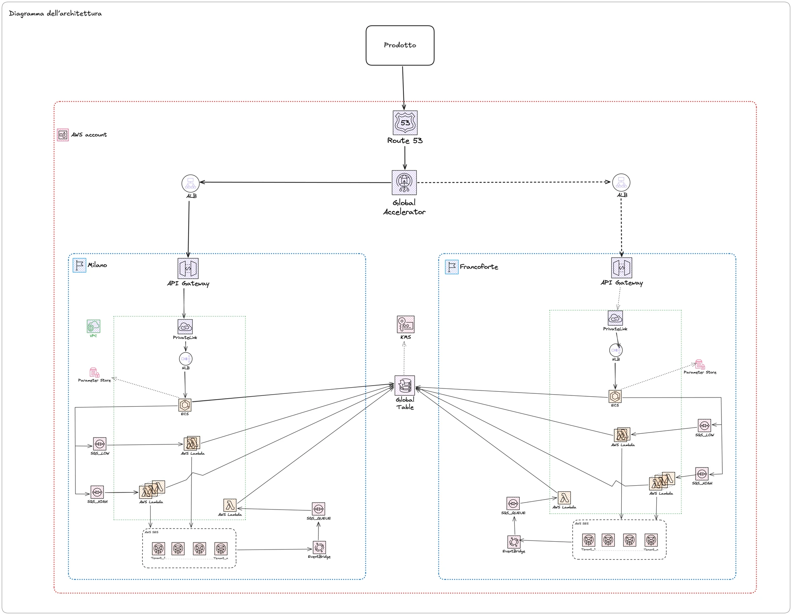

# One Mail

1. [What is?](#what-is)
2. [Architecture](#architecture)
   - [Main technologies used](#main-technologies-used)
3. [Getting Started](#getting-started)
   - [Prerequisites](#prerequisites)
   - [Installation](#installation)
   - [Run the application](#run-the-application)
     - [Configuration](#configuration)
     - [Local run](#local-run)
     - [OpenApi](#openapi)
     - [Build](#build)
   - [Available scripts](#available-scripts)
4. [Contributing](#contributing)

## What is?

This project is a centralized messaging service designed to streamline and standardize email delivery and management across PagoPA products.

## Architecture



**CI/CD pipeline**\
The project is managed via a CI/CD pipeline that ensures code integrity and efficient deployment. Key features include: code validation for every pull request, automatic deployment and infrastructure update (IaC).

### Main technologies used

- Express
- Typescript
- Dotenv
- ZOD
- Powertools for AWS Lambda
- Vitest
- AWS
- Github Actions
- Terraform

## Getting started

### Prerequisites

- Node and pnpm (the node version is stored in the `.nvmrc` file, we recommend to use [nvm](https://github.com/nvm-sh/nvm) to quickly install and use different versions of node).
- If you use VSCode editor install [prettier](https://marketplace.visualstudio.com/items?itemName=esbenp.prettier-vscode).

### Installation

1. Clone the repository:
   ```bash
   git clone <REPOSITORY_URL>
   ```
2. Install and use node version defined in the .nvmrc file:
   ```bash
   nvm install && nvm use
   ```
3. Install pnpm: corepack enable pnpm
   ```bash
   corepack enable pnpm
   ```
3. Install dependencies:
   ```bash
   pnpm install
   ```
4. Install pre-commit hooks
   ```bash
   pnpm setup:hooks
   ```
   See [pre-commit.md](docs/extending/pre-commit.md) for more info.
5. Use Dev Container

   You can use the development container to run a ready-made development environment with all dev dependencies. For more details: See [Dev Container](docs/extending/dev-container.md)


### Run the application

#### Configuration
1. For each project inside `src/onemail` that contains a `.env.example` file, create a local .env file based on that example. You can duplicate `.env.example` and rename it to `.env`.
2. Fill in the `.env` file with the required environment variables.
3. Do not commit your `.env` file.

#### Local run
To run in development mode (local):

```bash
# dispatcher
pnpm dev:dispatcher
```

```bash
# sender
pnpm dev:sender
```

#### OpenAPI

When running the services locally, two endpoints are exposed for API documentation and interactive testing:

- `/api-docs`: serves the generated JSON OpenAPI.
- `/api-docs/ui`: serves the Swagger UI where you can explore and test the APIs.

These routes are enabled only in local mode and are not available in production.
Run `pnpm run generate:openapi` to generate the JSON OpenAPI file and save it to `apidoc/openapi-docs.json`.


#### Build
To compile in production mode:

```bash
# dispatcher
pnpm run build:dispatcher
```

```bash
# sender
pnpm run build:sender
```

### Available scripts

- `pnpm run dev`: Start all workspace services in development mode (in parallel).
- `pnpm run build`: Build all workspace packages (in parallel).
- `pnpm run dev:dispatcher`: Start the dispatcher service in development mode.
- `pnpm run dev:sender`: Start the sender service in development mode.
- `pnpm run build:dispatcher`: Build the dispatcher package.
- `pnpm run build:sender`: Build the sender package.
- `pnpm run package:dispatcher`: Package the dispatcher service into `dist-artifact/om-ecs-dispatcher`.
- `pnpm run package:sender`: Package the sender service and create the `om-lambda-sender.zip` archive for deployment.
- `pnpm run type-check`: Run TypeScript type checking.
- `pnpm run lint:check`: Run ESLint checks (no auto-fix).
- `pnpm run lint`: Run ESLint with auto-fix.
- `pnpm run format:check`: Run Prettier in check mode.
- `pnpm run format`: Format files with Prettier.
- `pnpm run setup:hooks`: Install pre-commit hooks (runs `scripts/setup-pre-commit-hooks.sh`).
- `pnpm run generate:openapi`: Generates the JSON OpenAPI documentation.
- `pnpm run version`: Run Changesets to create package version bumps and update lockfile

\
<br/>

## Contributing

We use [conventional commits](https://conventionalcommits.org/) to improve readability of the project history and to automate the release process. The commit message should therefore respect the following format:

```
<type>[optional scope/task]: <description>

[optional body]

[optional footer(s)]
```

- type: describes the category of the change. See [supported types](docs/extendings/commit-types.md).
- scope/task: (optional) describes what is affected by the change
- description: a small description of the change
- body: (optional) additional contextual information about the change
- footer: (optional) adds external links, references and other meta-information

i.e.:

```
chore: automate release
fix(routes): fix send email route path
feat(OM-101): add zod validation
```

We use [pre-commit](https://pre-commit.com/) to ensures code quality and consistency, and [commitlint](https://github.com/conventional-changelog/commitlint) to validate messages when commiting.

> [!IMPORTANT]
> See [pre-commit.md](docs/extending/pre-commit.md) for setup, troubleshooting and how to install the hooks.

We use Prettier for formatting and ESLint for rules/auto-fixes. For details and recommended settings see [code-style.md](docs/extending/code-style.md).

We use [Github actions](https://github.com/features/actions) together with [Changeset](https://github.com/changesets/changesets) to release a new version (with changelog) once a PR gets merged into main branch.
